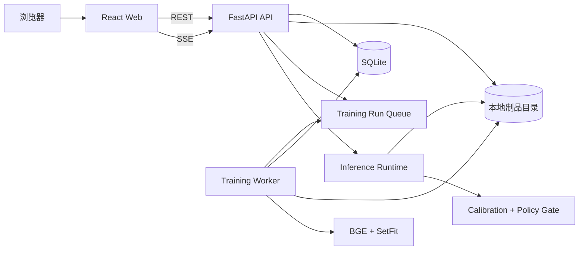
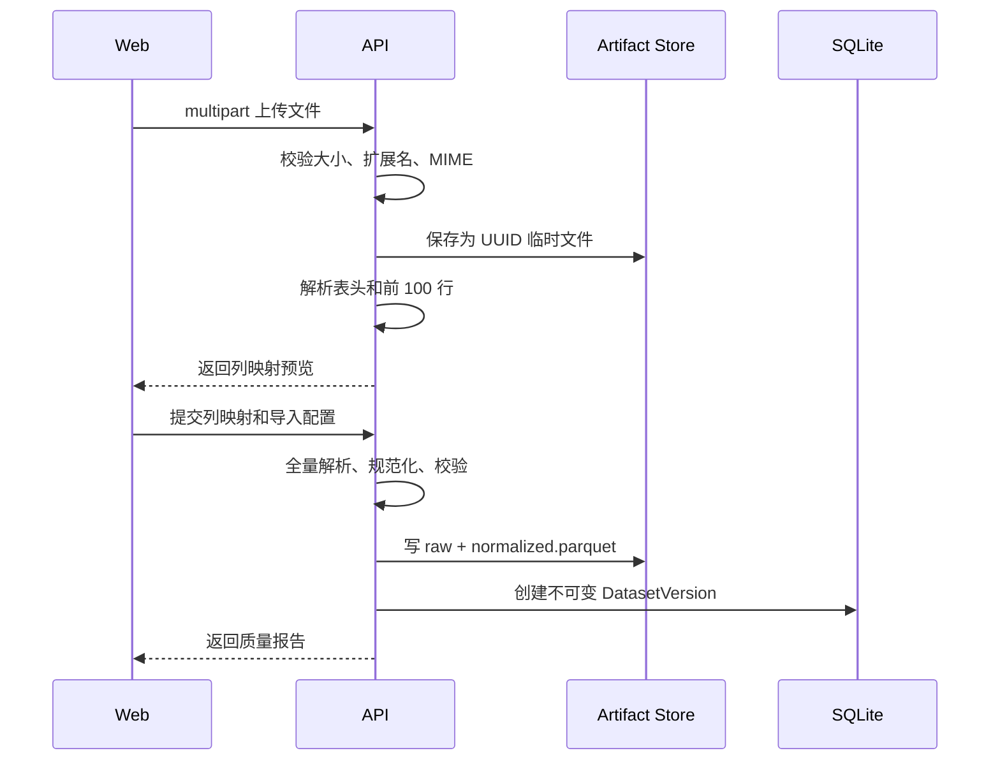
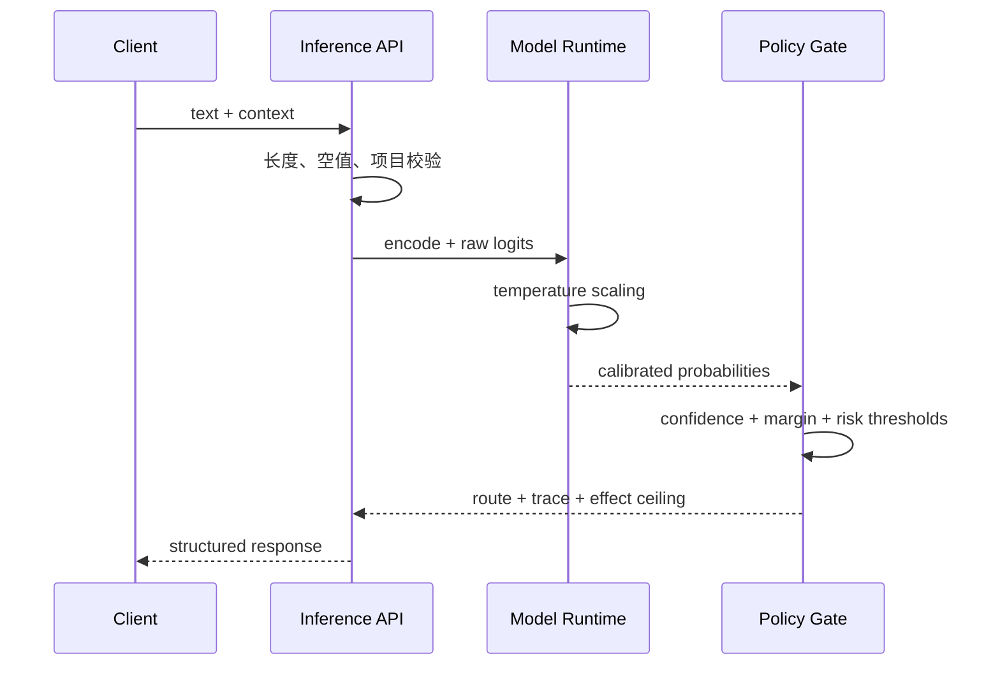

# 本地意图路由器训练与可视化平台技术设计

> 文档状态：可实施设计稿  
> 推荐模型：`BAAI/bge-small-zh-v1.5` + SetFit  
> 产品形态：本地优先的 Web 训练、评测、模型管理与 Playground 平台  
> 目标读者：负责实现的工程 Agent、算法工程师、前后端工程师

## 1. 摘要与关键决策

本项目构建一个可以在个人电脑上运行的意图路由器工作台。用户可以通过 Web 页面导入和标注 Query、配置训练参数、启动 SetFit 训练、查看评测和错误样本、校准拒识阈值、激活模型，并在 Playground 中观察单条或批量 Query 的路由结果与决策轨迹。

第一版只解决路由链路的第一层问题：**用户是在了解信息、查询真实状态、要求修改状态、表达不清，还是超出系统范围**。第一版不直接选择具体 Skill，也不直接执行任何写操作。

核心技术决策如下：

1. 使用 `BAAI/bge-small-zh-v1.5` 作为文本编码器，使用 SetFit 完成嵌入微调和多分类训练。
2. 第一版采用五分类：`information`、`read_only`、`write_action`、`unclear`、`oos`。
3. 分类结果不等于执行授权。`write_action` 只允许后续系统召回写 Skill，真实写入仍必须经过对象校验、参数校验、风险门禁和用户确认。
4. 使用置信度、Top1/Top2 margin 和风险分级阈值形成确定性决策门，允许系统返回 `unclear`，禁止强制选择 Top1。
5. API 与训练 Worker 分进程运行。训练任务不得占用 FastAPI 请求进程。
6. 第一版本地单用户运行，使用 SQLite 和本地文件制品库，不引入 Redis、Celery、对象存储等外部依赖。
7. 数据集版本、训练配置、阈值、代码版本和模型制品全部可追溯；已用于训练的数据版本不可原地修改。

## 2. 目标、非目标与成功标准

### 2.1 产品目标

在不显著增加用户操作成本的前提下，让 Agent 在模糊意图下不误执行，在明确意图下顺利进入正确的后续处理通道。

### 2.2 北极星指标

```text
安全有效解决率 =
正确回答或进入正确动作通道，且未触发未授权操作的模糊意图会话数
÷ 模糊意图会话总数
```

阶段目标为安全有效解决率不低于 90%。

### 2.3 硬门槛与守护指标

| 指标 | MVP 验收标准 | 说明 |
|---|---:|---|
| 未授权外部写入率 | 0 | 本系统本身不实现写工具调用 |
| 高风险操作确认覆盖率 | 100% | 由下游执行门实现；本系统输出不得绕过 |
| 非写请求误判为 `write_action` | 测试集 ≤0.5% | 核心安全指标 |
| `write_action` Precision | ≥95% | 数据量充足后提高到 98% |
| Macro F1 | ≥85% | 避免被头部类别掩盖 |
| OOS Recall | ≥85% | 防止领域外请求被硬接入 |
| 澄清后一次解决率 | ≥80% | 线上集成后统计 |
| 单条 CPU 推理 P95 | ≤100ms | 不包含首次模型加载 |

当测试集中非写样本不足 300 条时，“误判率为 0”只能作为观测结果，不能解释为真实误判概率为 0；评测页面必须同时展示样本数和置信区间。

### 2.4 非目标

第一版明确不做：

- 不负责具体 Skill 的最终选择和执行。
- 不从 PDF、Word 或知识库文档中自动生成可靠训练标签。
- 不做多人权限、组织级模型中心和远程分布式训练。
- 不把模型置信度解释为用户授权。
- 不允许上传任意 Python 代码、自定义 pickle 或远程模型代码。
- 不追求端到端生成澄清话术；第一版仅返回结构化澄清候选。

## 3. 意图体系与决策契约

### 3.1 五分类定义

| 标签 | 定义 | 正例 | 反例 |
|---|---|---|---|
| `information` | 获取概念、规则、方法或能力说明，不读取真实业务状态 | “Libra 怎么创建实验？” | “查实验 123 的状态” |
| `read_only` | 明确要求读取真实对象或执行只读诊断 | “审批到哪了？” | “帮我催一下审批” |
| `write_action` | 明确要求创建、修改、发送、撤回、提交、启动等状态变化 | “帮我撤回 Review 123” | “怎么撤回 Review？” |
| `unclear` | 动作、对象或结果不足，无法安全决定 | “帮我处理一下这个实验” | “分析实验 123 为什么异常” |
| `oos` | 不属于当前 Agent 的业务和能力范围 | “帮我预订会议室” | “Libra 是否支持暂停实验？” |

`NOTA` 不作为第一层五分类标签。它属于第二阶段 Skill 候选选择：请求可能属于 Libra，但当前候选 Skill 都不匹配。第一版在 API 契约中预留 `nota` 决策值，但不训练该标签。

### 3.2 路由输出契约

```json
{
  "request_id": "req_01J...",
  "model_version": "intent-router-v1.2.0",
  "route": "write_action",
  "decision": "accept",
  "confidence": 0.93,
  "margin": 0.41,
  "top_k": [
    {"label": "write_action", "probability": 0.93},
    {"label": "read_only", "probability": 0.52},
    {"label": "unclear", "probability": 0.18}
  ],
  "effect_ceiling": "external_write_candidate",
  "required_next_gate": "skill_match_and_confirmation",
  "reason_codes": ["WRITE_THRESHOLD_PASSED", "MARGIN_PASSED"],
  "latency_ms": 23
}
```

`effect_ceiling` 只能限制后续允许的最大副作用，不能提升权限：

| route | effect_ceiling | 后续允许行为 |
|---|---|---|
| `information` | `none` | 普通回答、知识库 |
| `read_only` | `read_only` | 只读 Skill 候选召回 |
| `write_action` | `external_write_candidate` | 写 Skill 可进入候选，但不得自动执行 |
| `unclear` | `none` | 澄清或安全回答 |
| `oos` | `none` | 能力边界提示 |

### 3.3 确定性决策门

模型负责给出概率，策略层负责是否接受：

```python
def decide(probabilities, thresholds):
    ranked = sort_desc(probabilities)
    top1, top2 = ranked[0], ranked[1]
    margin = top1.probability - top2.probability

    if top1.label == "write_action":
        min_confidence = thresholds.write_min_confidence
    elif top1.label == "oos":
        min_confidence = thresholds.oos_min_confidence
    else:
        min_confidence = thresholds.default_min_confidence

    if top1.probability < min_confidence:
        return unclear("LOW_CONFIDENCE")

    if margin < thresholds.min_margin:
        return unclear("LOW_MARGIN")

    return accept(top1.label)
```

默认冷启动参数，仅用于首次实验：

```yaml
default_min_confidence: 0.65
write_min_confidence: 0.85
oos_min_confidence: 0.70
min_margin: 0.15
```

最终阈值必须从 validation 集搜索并在独立 test 集冻结评估，禁止根据 test 集反复调参。

## 4. 系统架构



### 4.1 进程划分

| 进程 | 职责 | 禁止事项 |
|---|---|---|
| Web | 上传、配置、可视化、Playground | 不直接访问模型文件和数据库 |
| API | 校验请求、管理元数据、推理、提供 SSE | 不在请求线程中训练 |
| Worker | 领取训练任务、训练、校准、评测、生成制品 | 不监听公网端口 |
| SQLite | 元数据、任务状态、指标索引 | 不保存大文件和模型权重 |
| Artifact Store | 数据快照、日志、指标、模型、清单 | 路径不能来自用户直接输入 |

### 4.2 推荐技术栈

后端：

- Python 3.11 或 3.12
- FastAPI、Uvicorn、Pydantic v2
- SQLAlchemy 2、Alembic、SQLite WAL
- SetFit、Sentence Transformers、Hugging Face Datasets
- PyTorch、scikit-learn、NumPy、pandas、PyArrow、SciPy
- `python-multipart` 用于上传
- pytest、pytest-asyncio、httpx

前端：

- React + TypeScript + Vite
- Ant Design：表格、表单、上传、步骤条和基础布局
- TanStack Query：服务端状态和轮询
- ECharts：混淆矩阵、分布、校准曲线、阈值曲线
- React Hook Form + Zod：训练参数和 Playground 输入校验
- Vitest + React Testing Library + Playwright

不要在设计文档中锁死短期版本号。实现时应生成并提交 Python lockfile 与前端 lockfile，训练制品同时保存依赖快照。

### 4.3 推荐仓库结构

```text
intent-router-studio/
├── backend/
│   ├── pyproject.toml
│   ├── alembic.ini
│   ├── migrations/
│   ├── app/
│   │   ├── main.py
│   │   ├── config.py
│   │   ├── db.py
│   │   ├── api/
│   │   │   ├── projects.py
│   │   │   ├── datasets.py
│   │   │   ├── runs.py
│   │   │   ├── models.py
│   │   │   └── inference.py
│   │   ├── schemas/
│   │   ├── services/
│   │   │   ├── dataset_service.py
│   │   │   ├── run_service.py
│   │   │   ├── artifact_service.py
│   │   │   └── inference_service.py
│   │   ├── router_core/
│   │   │   ├── taxonomy.py
│   │   │   ├── normalization.py
│   │   │   ├── splitting.py
│   │   │   ├── training.py
│   │   │   ├── calibration.py
│   │   │   ├── threshold_search.py
│   │   │   ├── evaluation.py
│   │   │   ├── policy.py
│   │   │   └── runtime.py
│   │   ├── worker/
│   │   │   ├── main.py
│   │   │   ├── queue.py
│   │   │   └── run_executor.py
│   │   └── models/
│   └── tests/
├── frontend/
│   ├── package.json
│   ├── vite.config.ts
│   ├── src/
│   │   ├── api/
│   │   ├── components/
│   │   ├── pages/
│   │   ├── features/datasets/
│   │   ├── features/training/
│   │   ├── features/evaluation/
│   │   ├── features/playground/
│   │   ├── features/models/
│   │   └── types/
│   └── tests/
├── var/
│   ├── app.db
│   ├── uploads/
│   ├── projects/
│   ├── runs/
│   └── models/
├── scripts/
│   ├── bootstrap.sh
│   ├── dev.sh
│   ├── smoke_train.py
│   └── export_model.py
├── Makefile
├── .env.example
├── README.md
└── TECHNICAL_DESIGN.md
```

`var/` 默认加入 `.gitignore`。仅测试夹具和脱敏示例数据可以进入版本控制。

## 5. 数据导入、标注与版本管理

### 5.1 支持的导入模式

1. **已标注数据**：CSV、JSONL、XLSX，用户映射文本列和标签列。
2. **未标注 Query 列表**：CSV、JSONL、XLSX、TXT，导入后进入标注工作台。
3. **按标签导入**：用户选择一个标签，整个文件中的 Query 默认使用该标签，随后人工抽查。

第一版不接受 PDF、Word 和任意压缩包作为训练样本。它们可以在未来通过独立抽取链转换成 Query，但不能直接送入训练。

### 5.2 标准数据格式

规范化后的 Parquet 数据字段：

| 字段 | 类型 | 必填 | 说明 |
|---|---|---:|---|
| `sample_id` | UUID | 是 | 导入时生成 |
| `text` | string | 是 | 当前用户 Query |
| `label` | enum/null | 训练前是 | 五分类标签 |
| `group_id` | string | 建议 | 同模板、同来源或同会话分组 |
| `context` | string/null | 否 | 最近一轮必要上下文，不存完整对话 |
| `source` | string/null | 否 | manual、online、synthetic 等 |
| `is_hard_negative` | bool | 否 | 是否为边界反例 |
| `risk_slice` | string/null | 否 | write_vs_qa、readonly_vs_write 等 |
| `metadata_json` | JSON string | 否 | 非核心扩展字段 |
| `normalized_hash` | sha256 | 是 | 去重与泄漏检查 |

多轮输入统一编码：

```text
[CONTEXT]
助手上一轮：你是想查看状态还是撤回 Review？
[USER]
只看状态
```

禁止把完整聊天历史无界拼接给模型。默认最多保留最近一轮必要上下文，且 `max_length` 默认 256。

### 5.3 上传流程



后端使用 `UploadFile`，避免把大文件一次性读入内存。默认限制：单文件 100MB、最多 500,000 行、单条 Query 4,000 字符。

### 5.4 数据校验规则

阻断级错误：

- 缺少文本列或训练数据缺少标签列。
- 标签不在当前 Label Schema。
- 文本为空或仅包含空白。
- 同一 `normalized_hash` 对应不同标签。
- 文件无法以 UTF-8/UTF-8-SIG 解析且用户未指定编码。
- 行数、文件大小或单条文本超过限制。

警告级问题：

- 类别样本数少于 20。
- 类别最大/最小样本数比超过 10。
- 重复率超过 10%。
- `group_id` 缺失。
- hard negative 占比低于 20%。
- 训练集和测试集存在规范化文本重叠。

### 5.5 数据切分

默认比例：train 70%、validation 15%、test 15%。

切分优先级：

1. 按 `group_id` 做分组切分，整个语义模板组只能出现在一个 split。
2. 在组级别尽可能维持标签分布。
3. 用户已提供 split 时保留，但仍执行泄漏检查。
4. 另建 `risk_test`，保存最小差异、否定约束、OOS 和多轮改口样本，不参与调参。

禁止将下列近义样本随机分到不同集合：

```text
帮我创建一个实验
帮我新建一个实验
创建一个新实验
```

### 5.6 数据集版本

`DatasetVersion` 一旦进入训练即不可修改。新增、删除、改标签均创建下一版本，并记录：

- 父版本 ID
- 原始文件 SHA256
- 规范化规则版本
- 标签 Schema 版本
- 行数和类别分布
- split seed 与 group split 算法版本
- 创建人和创建时间
- 变更摘要

## 6. 训练流水线

### 6.1 训练状态机

```text
DRAFT
  → QUEUED
  → PREPARING
  → TRAINING_EMBEDDING
  → TRAINING_HEAD
  → CALIBRATING
  → SEARCHING_THRESHOLDS
  → EVALUATING
  → PACKAGING
  → SUCCEEDED

任意运行态 → CANCELLING → CANCELLED
任意运行态 → FAILED
```

每个阶段写入进度、开始时间、结束时间、日志位置和结构化事件。Worker 在每个阶段边界检查取消标记。

### 6.2 默认训练配置

```yaml
base_model_id: BAAI/bge-small-zh-v1.5
seed: 42
device: auto
max_length: 256

setfit:
  batch_size: 16
  num_epochs: 5
  body_learning_rate: 0.00002
  sampling_strategy: oversampling
  num_iterations: 20
  samples_per_label: 2
  normalize_embeddings: true

calibration:
  method: temperature_scaling
  metric: nll

threshold_search:
  default_range: [0.50, 0.95, 0.01]
  write_range: [0.70, 0.99, 0.01]
  oos_range: [0.50, 0.95, 0.01]
  margin_range: [0.00, 0.30, 0.01]
  constraints:
    max_false_write_rate: 0.005
    min_write_precision: 0.95
  objective: maximize_safe_coverage
```

Web 参数面板对常用参数开放，对危险或不稳定参数放入“高级设置”。输入必须有范围限制：

| 参数 | 默认 | UI 范围 |
|---|---:|---:|
| batch size | 16 | 4～64 |
| epochs | 5 | 1～20 |
| body learning rate | 2e-5 | 1e-6～1e-4 |
| max length | 256 | 64～512 |
| seed | 42 | 0～2³¹-1 |
| num iterations | 20 | 1～50 |

### 6.3 设备选择

```python
def resolve_device(requested: str) -> str:
    if requested != "auto":
        validate_available(requested)
        return requested
    if torch.cuda.is_available():
        return "cuda"
    if torch.backends.mps.is_available():
        return "mps"
    return "cpu"
```

Mac 默认使用 MPS；如果训练遇到不支持的算子，页面应允许用户切换 CPU 重试，并在系统信息页展示 PyTorch、设备、内存和可用磁盘。不要在 Docker 容器内承诺 MPS 训练；Mac 本地训练应原生运行 Worker。

### 6.4 训练步骤

1. 加载冻结的数据快照和 Label Schema。
2. 设置 Python、NumPy、PyTorch 和 SetFit 随机种子。
3. 加载基础模型，默认禁止 `trust_remote_code=True`。
4. 使用 SetFit 微调嵌入和分类头。
5. 保存 validation/test 的原始 logits、标签和 sample ID。
6. 在 validation 上拟合温度参数。
7. 在校准后的 validation 概率上搜索阈值。
8. 使用冻结阈值评估 test 和 risk_test。
9. 生成指标、错误分析文件、模型卡和模型制品。
10. 原子地将运行状态切换为 `SUCCEEDED`。

### 6.5 概率校准

SetFit 默认分类头的概率不能直接假设已经校准。第一版实现多分类 temperature scaling：

```text
calibrated_probability = softmax(logits / T)
```

只在 validation 集拟合标量 `T > 0`，以 NLL 最小为目标。保存：

```json
{
  "method": "temperature_scaling",
  "temperature": 1.37,
  "fitted_on_dataset_version": "dsv_...",
  "before": {"nll": 0.52, "ece": 0.11},
  "after": {"nll": 0.41, "ece": 0.05}
}
```

评测页面展示校准前后 NLL、ECE、Brier Score 和 reliability diagram。校准不改变类别排序，但影响接受/拒识阈值。

### 6.6 阈值搜索

阈值搜索不能只最大化 Accuracy。推荐优化：

```text
在满足：
  false_write_rate <= 上限
  write_precision >= 下限
的候选中，最大化：
  safe_coverage = accepted_correct_samples / all_samples
若并列，则选择 Macro F1 更高、阈值更保守的组合。
```

输出完整 Pareto 数据供 Web 可视化，不只保存最终阈值。用户可以在 UI 中拖动阈值模拟，但只有点击“保存为阈值版本”后才生成不可变策略版本。

### 6.7 训练任务并发与恢复

- 默认全局只允许一个训练任务运行，推理可以继续使用已激活模型。
- Worker 使用 SQLite 原子条件更新领取 `QUEUED` 任务，避免两个 Worker 重复训练。
- API 重启不得终止 Worker；Worker 重启后将超时的运行态任务标记为 `INTERRUPTED`，由用户选择重试。
- 重试创建新 Run，并引用原 Run；不得覆盖旧日志与制品。
- 训练结果未知时不能自动宣布成功，必须验证 `manifest.json`、模型目录和最终指标文件完整。

## 7. 评测与错误分析

### 7.1 必备指标

- Accuracy
- Macro、Micro、Weighted F1
- 每类 Precision、Recall、F1、Support
- 混淆矩阵
- `write_action` Precision、Recall
- False Write Rate：真实标签非写但预测并接受为写
- OOS Precision、Recall
- Unclear Rate、Accepted Coverage、Selective Accuracy
- Top1 confidence 与 margin 分布
- NLL、ECE、Brier Score
- CPU/MPS/CUDA 推理延迟 P50/P95/P99

### 7.2 路由级指标定义

```text
accepted = 决策门输出 accept
coverage = accepted_count / total_count
selective_accuracy = accepted_correct_count / accepted_count
false_write_rate = accepted_write_on_non_write / total_non_write
clarification_rate = unclear_decision_count / total_count
```

页面同时展示“模型原始分类指标”和“经过阈值门后的路由指标”，禁止混为一谈。

### 7.3 风险切片

至少内置：

- `qa_vs_write`：怎么做 vs 帮我做
- `readonly_vs_write`：查看 vs 修改/催办/撤回
- `negation`：只看不要改、先分析不要提交
- `missing_object`：动作明确但缺少目标
- `oos_near_domain`：词相似但领域外
- `typo_colloquial`：错别字、简称、口语
- `multi_turn_correction`：用户改口或回答澄清
- `long_context`：带 PRD 摘要或上下文

每个切片显示样本数、Macro F1、false write 和 error list。

### 7.4 错误样本表

字段：

- sample_id、text、context
- true label、raw prediction、final decision
- Top-K 概率、margin
- reason codes
- risk slice、source、group_id
- “加入下一数据集版本”按钮
- 新标签、备注、是否 hard negative

错误修正不得直接修改当前测试集或当前 Run。系统创建 Dataset Draft，用户确认后生成下一版本。

## 8. 模型制品与注册中心

### 8.1 制品目录

```text
var/models/{model_version_id}/
├── setfit_model/
├── label_schema.json
├── calibration.json
├── thresholds.json
├── metrics.json
├── confusion_matrix.json
├── per_sample_predictions.parquet
├── environment.json
├── model_card.md
└── manifest.json
```

### 8.2 manifest

```json
{
  "schema_version": 1,
  "model_version": "intent-router-v1.2.0",
  "base_model": "BAAI/bge-small-zh-v1.5",
  "dataset_version_id": "dsv_01J...",
  "label_schema_version": "labels-v1",
  "run_id": "run_01J...",
  "seed": 42,
  "created_at": "2026-08-21T10:00:00+08:00",
  "artifact_hashes": {
    "setfit_model/model.safetensors": "sha256:...",
    "thresholds.json": "sha256:..."
  },
  "metrics_summary": {
    "macro_f1": 0.89,
    "false_write_rate": 0.002,
    "safe_coverage": 0.86
  }
}
```

激活模型时校验所有 hash。只允许加载系统自身产生且 manifest 完整的制品。禁止上传和执行未知 pickle；模型权重优先使用 safetensors。

### 8.3 模型状态

```text
CANDIDATE → VALIDATED → ACTIVE → ARCHIVED
```

同一个 Project 只能有一个 ACTIVE 模型。激活新模型使用数据库事务；Inference Runtime 原子加载新版本，加载失败时保持旧模型服务。

## 9. 后端 API 设计

基础路径：`/api/v1`。所有响应包含 `request_id`。错误结构：

```json
{
  "error": {
    "code": "DATASET_LABEL_CONFLICT",
    "message": "同一规范化文本对应多个标签",
    "details": {"sample_ids": ["..."]},
    "request_id": "req_..."
  }
}
```

### 9.1 系统接口

| Method | Path | 用途 |
|---|---|---|
| GET | `/health` | 存活检查 |
| GET | `/system/info` | Python、PyTorch、设备、内存、磁盘 |
| GET | `/system/config` | 非敏感运行配置 |

### 9.2 项目与标签

| Method | Path | 用途 |
|---|---|---|
| POST | `/projects` | 创建项目 |
| GET | `/projects` | 项目列表 |
| GET | `/projects/{id}` | 项目详情 |
| PATCH | `/projects/{id}` | 修改名称和描述 |
| GET | `/projects/{id}/label-schema` | 获取标签定义 |
| POST | `/projects/{id}/label-schema/versions` | 创建标签版本 |

第一版默认标签 Schema 固定为五分类。允许修改说明和示例，但修改 label key 必须创建新 Schema 版本并重新训练。

### 9.3 数据集接口

| Method | Path | 用途 |
|---|---|---|
| POST | `/projects/{id}/uploads` | multipart 上传 |
| GET | `/uploads/{id}/preview` | 表头和样本预览 |
| POST | `/uploads/{id}/import` | 提交列映射和导入配置 |
| GET | `/datasets/{id}` | 数据集版本详情 |
| GET | `/datasets/{id}/samples` | 分页、过滤样本 |
| POST | `/datasets/{id}/validate` | 执行质量检查 |
| POST | `/datasets/{id}/split` | 创建冻结 split |
| POST | `/datasets/{id}/drafts` | 从错误样本创建下一版本草稿 |
| POST | `/dataset-drafts/{id}/commit` | 生成不可变版本 |

上传为 multipart，列映射和导入配置通过单独 JSON 请求提交，避免在同一请求中混用文件和复杂 JSON Body。

### 9.4 训练接口

| Method | Path | 用途 |
|---|---|---|
| POST | `/projects/{id}/runs` | 创建并排队训练 |
| GET | `/runs/{id}` | 状态和配置 |
| GET | `/runs/{id}/events` | SSE 日志和进度 |
| POST | `/runs/{id}/cancel` | 请求取消 |
| POST | `/runs/{id}/retry` | 创建重试 Run |
| GET | `/runs/{id}/metrics` | 指标与切片 |
| GET | `/runs/{id}/errors` | 错误样本分页 |
| POST | `/runs/{id}/thresholds/simulate` | 模拟阈值 |
| POST | `/runs/{id}/threshold-versions` | 保存阈值版本 |
| POST | `/runs/{id}/register-model` | 注册候选模型 |

创建训练请求：

```json
{
  "dataset_version_id": "dsv_01J...",
  "name": "bge-v1-hard-negative",
  "config": {
    "base_model_id": "BAAI/bge-small-zh-v1.5",
    "seed": 42,
    "device": "auto",
    "max_length": 256,
    "batch_size": 16,
    "num_epochs": 5,
    "body_learning_rate": 0.00002,
    "sampling_strategy": "oversampling",
    "num_iterations": 20
  }
}
```

### 9.5 模型与推理接口

| Method | Path | 用途 |
|---|---|---|
| GET | `/projects/{id}/models` | 模型列表 |
| POST | `/models/{id}/activate` | 激活模型 |
| POST | `/models/{id}/archive` | 归档 |
| GET | `/models/{id}/manifest` | 模型清单 |
| POST | `/inference/predict` | 单条推理 |
| POST | `/inference/batch` | 批量推理，限制 1,000 条 |
| POST | `/inference/compare` | 比较两个模型版本 |

推理请求：

```json
{
  "project_id": "prj_01J...",
  "text": "根据这份 PRD 创建实验",
  "context": null,
  "model_version_id": null,
  "threshold_overrides": null,
  "debug": true
}
```

`model_version_id=null` 使用 ACTIVE 模型。阈值覆盖只允许 Playground 使用，不得影响 ACTIVE 策略。

### 9.6 SSE 事件

```text
event: progress
data: {"stage":"TRAINING_EMBEDDING","percent":42,"message":"epoch 2/5"}

event: metric
data: {"name":"embedding_loss","value":0.124,"step":60}

event: log
data: {"level":"INFO","message":"Starting calibration"}

event: terminal
data: {"status":"SUCCEEDED","model_version_id":"mdl_..."}
```

连接断开后，前端使用 `Last-Event-ID` 续传；API 从结构化事件表或事件 JSONL 中继续读取。

## 10. 数据库设计

主要表：

| 表 | 关键字段 |
|---|---|
| `projects` | id、name、description、active_model_id、created_at |
| `label_schema_versions` | id、project_id、version、schema_json、hash |
| `uploads` | id、project_id、original_name、safe_path、sha256、status |
| `dataset_versions` | id、project_id、parent_id、schema_id、manifest_json、status |
| `dataset_quality_reports` | dataset_id、report_json、created_at |
| `training_runs` | id、project_id、dataset_id、config_json、status、stage、progress、worker_id、cancel_requested |
| `run_events` | id、run_id、sequence、event_type、payload_json、created_at |
| `run_metrics` | run_id、split、slice、metric_name、value、support |
| `threshold_versions` | id、run_id、version、config_json、metrics_json |
| `model_versions` | id、project_id、run_id、threshold_id、status、artifact_path、manifest_hash |
| `playground_cases` | id、project_id、text、context、expected_label、tags |

通用要求：

- ID 使用 UUIDv7/ULID，避免暴露连续数量。
- 时间统一存 UTC，前端按本地时区展示。
- JSON 字段存配置和汇总，不存大数组；逐样本预测存 Parquet。
- SQLite 启用 WAL、foreign keys 和 busy timeout。
- 所有状态迁移做条件更新，避免并发覆盖。

## 11. Worker 与任务队列

第一版 Worker 每 1 秒轮询任务表，使用原子条件更新领取任务：

```sql
UPDATE training_runs
SET status = 'PREPARING',
    worker_id = :worker_id,
    started_at = CURRENT_TIMESTAMP
WHERE id = (
    SELECT id FROM training_runs
    WHERE status = 'QUEUED'
    ORDER BY created_at
    LIMIT 1
)
AND status = 'QUEUED';
```

然后检查受影响行数。仅领取成功的 Worker 执行训练。

Worker 要求：

- 捕获 SIGTERM，在安全阶段设置 `INTERRUPTED`。
- 每 10 秒更新 heartbeat。
- 日志同时写人类可读 `.log` 和结构化 `events.jsonl`。
- 每个 Run 设置独立工作目录，完成后通过目录 rename 原子发布。
- 训练前检查磁盘空间，至少保留预计制品大小的 3 倍。
- 使用 `psutil` 记录峰值 RSS、CPU 和运行时长。

第一版不支持并行训练。以后迁移 Postgres/Redis 队列时保持 Run API 和状态机不变。

## 12. Web 前端信息架构

### 12.1 页面导航

```text
项目概览
├── 数据集
│   ├── 上传与导入
│   ├── 标注工作台
│   └── 数据质量/版本
├── 训练
│   ├── 新建训练
│   └── Run 详情
├── 评测与错误分析
├── 模型注册中心
├── Playground
└── 系统设置
```

### 12.2 项目概览

展示：

- 当前 ACTIVE 模型、数据集版本和更新时间
- 安全有效解决率、Macro F1、False Write Rate、Coverage
- 最近训练任务和状态
- 类别分布与近七天 Playground 修正样本
- 快捷入口：上传数据、新建训练、打开 Playground

没有 ACTIVE 模型时显示明确引导，不自动选择最近 Run。

### 12.3 上传与导入

使用步骤条：

1. 选择文件和导入模式。
2. 文件预览与列映射。
3. 标签映射；未知标签必须人工处理。
4. 数据校验和冲突处理。
5. split 配置与分布预览。
6. 创建 Dataset Version。

质量报告同时区分 error 和 warning。存在 error 时禁止进入训练。

### 12.4 标注工作台

布局建议：

```text
┌────────────过滤与进度────────────┐
│ 未标注 128 / 全部 500            │
├──────────────────────────────────┤
│ Query 与必要上下文                │
│                                  │
│ [1] information  [2] read_only   │
│ [3] write_action [4] unclear     │
│ [5] oos                         │
│                                  │
│ hard negative □  risk slice ... │
├──────────────────────────────────┤
│ 相似样本、潜在重复、标签冲突      │
└──────────────────────────────────┘
```

支持快捷键、批量标注、撤销、跳过、相似样本提示。模型建议标签必须明显标记为“建议”，不能无提示自动写入真值。

### 12.5 新建训练

页面分为：

- 数据集与版本选择
- 基础配置预设：快速、标准、严格
- 训练参数
- 校准和阈值约束
- 运行前估算：样本数、设备、预计时长、磁盘
- 配置 JSON 预览

“开始训练”前展示不可变摘要，确认后创建 Run。

### 12.6 Run 详情

运行中：

- 状态步骤条和阶段进度
- 实时日志和 loss 曲线
- 设备、内存和运行时长
- 取消按钮

完成后：

- 指标总览
- 混淆矩阵
- 每类 PR/F1
- 校准前后曲线
- threshold vs coverage/false-write 曲线
- 风险切片
- 错误样本表
- 与基线 Run 比较
- 注册候选模型按钮

### 12.7 阈值调节器

四个滑块：default、write、OOS、margin。修改时只调用 `simulate`，返回：

- accepted coverage
- selective accuracy
- false write rate
- write precision/recall
- unclear rate
- 各类路由数量变化

当 false write 超过约束时使用红色阻断提示。保存阈值时创建新版本，不修改原 Run 指标。

### 12.8 Playground

单条模式：

```text
输入区：Query、可选上下文
模型：ACTIVE / 指定版本 / A-B 对比
阈值：正式策略 / 临时覆盖

输出区：
- 最终 route 与 accept/unclear/oos
- effect ceiling 与 required next gate
- Top-K 概率条形图
- confidence 和 margin
- 命中的阈值与 reason codes
- 推理延迟和模型版本
- “结果正确/错误”反馈
```

批量模式支持粘贴多行、上传 CSV、下载结果。导出 CSV 时对以 `= + - @` 开头的单元格做防公式注入转义。

A/B 对比模式并列展示两个模型的 route、概率、margin 和策略结果，并高亮差异。

### 12.9 模型注册中心

列表展示模型版本、数据集、Run、指标、状态和是否 ACTIVE。激活前检查：

- Run 成功且制品完整
- 测试指标达到项目门槛
- false write 未超过上限
- manifest hash 有效
- 标签 Schema 与当前项目兼容

激活动作需要二次确认，页面明确显示旧模型和新模型。

## 13. 推理运行时

### 13.1 加载

- API 启动时加载项目 ACTIVE 模型；没有模型时保持服务可用，但预测接口返回 `MODEL_NOT_ACTIVE`。
- 每个项目使用读写锁保护模型引用。
- 激活新模型先在临时对象完成加载和 smoke inference，再原子替换引用。
- 模型加载失败不影响旧模型。

### 13.2 推理流程



### 13.3 缓存

可以增加进程内 LRU 缓存，key 为：

```text
sha256(model_version + threshold_version + normalized_text + normalized_context)
```

默认容量 10,000，切换模型时自然因 key 变化失效。包含敏感文本时允许关闭缓存；日志默认只保存文本 hash，不保存完整 Query。

## 14. 安全、隐私与可靠性

### 14.1 默认网络边界

- API 和 Web 默认绑定 `127.0.0.1`。
- 如果用户显式开启局域网访问，必须配置访问 token、严格 CORS 和上传限额。
- 不在前端或日志中展示本机绝对路径。
- 不自动上传模型、数据或指标到 Hugging Face/W&B。

### 14.2 文件安全

- 使用服务端 UUID 生成保存路径，原文件名只作为元数据。
- 拒绝 `..`、绝对路径、符号链接和未知扩展名。
- 不支持 ZIP，避免 zip bomb 和目录穿越。
- 解析 XLSX 时限制 sheet、行列和解压后大小。
- 临时文件在成功或失败后按策略清理。

### 14.3 模型安全

- 默认 `trust_remote_code=False`。
- 首次下载基础模型后记录 commit hash；后续训练固定 revision。
- 只加载 manifest 允许的模型目录。
- 不接受用户上传的 pickle/joblib 模型。
- 系统自己产生的分类头若使用 joblib，必须放在受控制品目录并校验 hash；优先实现可 JSON 化或安全格式的制品。

### 14.4 数据隐私

- Playground 历史默认只保存 hash、预测和标签，不保存原文；用户显式勾选后才保存案例。
- 提供一键清理上传临时文件和 Playground 历史。
- 数据导出前提示检查敏感信息。
- 日志禁止记录完整上传行、访问 token 和环境变量。

## 15. 可观测性

结构化日志至少包含：

- request_id、project_id、run_id、model_version
- stage、event、duration_ms
- device、peak_memory_mb
- exception_type 和安全化错误信息

推理日志默认包含：

- 输入 hash、长度、是否有 context
- route、decision、confidence bucket、margin bucket
- reason codes、latency、模型和阈值版本

不要默认保存用户原文。可通过本地调试开关临时启用，页面必须有醒目标识。

## 16. 测试策略

### 16.1 后端单元测试

- 标签和输入规范化
- 重复与冲突检测
- group split 无泄漏
- 指标计算
- temperature scaling 数值稳定性
- 阈值搜索约束
- policy gate 边界值
- effect ceiling 映射
- 状态机非法迁移拒绝
- artifact hash 校验

### 16.2 集成测试

- 上传 → 导入 → 校验 → split → 创建 Run
- 使用极小 fixture 完成 smoke train
- Run 取消和重试
- SSE 断线续传
- 模型注册、激活和回滚
- 单条、批量和 A/B 推理
- API 重启后 ACTIVE 模型恢复

### 16.3 前端测试

- 上传列映射和错误显示
- 参数范围校验
- Run 状态和日志更新
- 阈值滑块模拟
- Playground 决策轨迹
- 模型激活确认

### 16.4 端到端测试

Playwright 必须覆盖：

1. 创建项目。
2. 上传示例 CSV。
3. 修复一个标签冲突。
4. 创建数据集版本。
5. 启动 smoke train 并等待成功。
6. 查看混淆矩阵和错误样本。
7. 注册并激活模型。
8. 在 Playground 验证三类 Query。

CI 中不下载真实 BGE 权重，可以使用 mock encoder 或预置 tiny model。真实模型 smoke test 标为手动或 nightly。

## 17. 本地运行与交付

### 17.1 环境变量

```dotenv
APP_ENV=development
APP_HOST=127.0.0.1
APP_PORT=8000
WEB_ORIGIN=http://127.0.0.1:5173
DATABASE_URL=sqlite:///./var/app.db
ARTIFACT_ROOT=./var
MAX_UPLOAD_MB=100
MAX_TRAINING_CONCURRENCY=1
HF_HOME=./var/hf-cache
LOG_RAW_TEXT=false
```

### 17.2 开发命令约定

```bash
make bootstrap     # 安装后端和前端依赖、初始化数据库
make api           # 启动 FastAPI
make worker        # 启动 Worker
make web           # 启动 Vite
make dev           # 同时启动三者
make test          # 单元和集成测试
make e2e           # Playwright
make smoke-train   # 使用脱敏小数据完成训练闭环
```

### 17.3 打包

第一版推荐原生本地运行，而不是将训练 Worker 放入 Docker。可提供：

- 前端构建成静态资源，由 FastAPI 托管。
- Python 虚拟环境安装脚本。
- macOS/Linux 启动脚本。
- 可选的 CPU-only Docker Compose，仅用于演示和 CI。

## 18. 实施阶段

### 阶段 1：Router Core 与 CLI Smoke Test

交付：

- 数据规范化、切分、训练、校准、阈值搜索、评测模块
- 本地命令完成从 CSV 到模型制品
- 固定 fixture 和风险测试集

验收：

- 相同 seed 和环境下可复现主要指标
- 模型制品包含完整 manifest
- policy gate 单元测试覆盖全部边界

### 阶段 2：API、数据库和 Worker

交付：

- 项目、数据集、Run、模型和推理 API
- SQLite migration
- 独立 Worker、SSE 事件和取消机制

验收：

- API 重启不丢任务和模型状态
- 训练不阻塞 health 和 Playground 请求
- 未完成制品不能注册为模型

### 阶段 3：数据与训练 Web

交付：

- 上传、列映射、质量报告、标注工作台
- 训练配置和 Run 详情
- 基础指标与日志可视化

验收：

- 非技术用户可以从文件上传完成一次训练
- 所有阻断问题在训练前可见

### 阶段 4：评测、阈值和 Playground

交付：

- 混淆矩阵、校准、阈值曲线、错误样本
- 阈值模拟和版本化
- 单条、批量和 A/B Playground

验收：

- 可以解释任一预测为什么被接受或转为 unclear
- 调整阈值不会污染原 Run

### 阶段 5：注册中心、加固与交付

交付：

- 模型注册、激活、回滚
- E2E、安全限制、清理策略
- README、运维和故障排查文档

验收：

- ACTIVE 模型切换失败时旧模型继续可用
- 从全新机器按 README 可以启动和完成 smoke train

## 19. 最终验收清单

实现 Agent 完成后逐项核验：

- [ ] Web 可导入 CSV、JSONL、XLSX 和 TXT。
- [ ] 支持列映射、标签映射、未标注数据人工标注。
- [ ] 数据冲突、重复、类别不平衡和 split 泄漏可见。
- [ ] Dataset Version 不可原地修改。
- [ ] 能配置并运行 BGE-small + SetFit 训练。
- [ ] API 与 Worker 独立，训练不阻塞 Web。
- [ ] 训练状态、日志和指标实时可见。
- [ ] 完成温度校准和风险约束阈值搜索。
- [ ] 同时展示 raw model 和 policy gate 指标。
- [ ] 可查看混淆矩阵、风险切片和错误样本。
- [ ] Playground 展示 Top-K、confidence、margin 和 reason codes。
- [ ] 支持阈值临时模拟、版本保存和 A/B 对比。
- [ ] 模型制品、数据、配置、依赖和 hash 可追溯。
- [ ] 模型激活失败不会影响旧模型。
- [ ] `write_action` 只输出写候选资格，不产生执行授权。
- [ ] 默认仅监听本机，默认不记录 Query 原文。
- [ ] 单元、集成和 Playwright E2E 通过。
- [ ] README 能指导全新环境完成 smoke train。

## 20. 后续扩展

### 20.1 第二阶段 Skill 路由

第一层输出 `read_only` 或 `write_action` 后，再使用 Skill Manifest 召回候选：

```yaml
id: experiment_review_revoke
allowed_routes: [write_action]
effect: external_write
when_to_use:
  - 用户明确要求撤回指定 Review
when_not_to_use:
  - 查询 Review 状态
  - 询问如何撤回 Review
required_slots:
  - experiment_id_or_review_id
confirmation: required
```

候选检索只能在 `allowed_routes` 范围内进行。最终选择加入 NOTA、Top1/Top2 margin 和 required slots 检查。必要时引入 `Qwen3-Reranker-0.6B` 对 Query 与 Skill 契约成对重排。

### 20.2 多头 Router

数据成熟后，将五分类升级为三个相对独立输出：

```text
outcome: information / artifact / state_change / unclear
authorization: absent / read_only / explicit_action
scope: in_scope / oos
```

策略层根据三个输出组合决定允许通道。升级前必须证明多头模型在 false write、OOS 和校准上优于五分类基线。

### 20.3 主动学习

将以下样本自动加入待标注池：

- 低 confidence 或低 margin
- A/B 模型结果不一致
- 用户点击“结果错误”
- Playground 人工修改标签
- 下游 Skill 拒绝或缺少关键参数

主动学习只能创建 Dataset Draft，不得自动修改真值和自动上线模型。

## 21. 参考资料

- [BAAI/bge-small-zh-v1.5 模型卡](https://huggingface.co/BAAI/bge-small-zh-v1.5)
- [SetFit Quickstart](https://huggingface.co/docs/setfit/quickstart)
- [SetFit Trainer API](https://huggingface.co/docs/setfit/reference/trainer)
- [SetFit Classification Heads](https://huggingface.co/docs/setfit/main/en/how_to/classification_heads)
- [FastAPI 文件上传](https://fastapi.tiangolo.com/tutorial/request-files/)
- [FastAPI StreamingResponse](https://fastapi.tiangolo.com/advanced/custom-response/)
- [PyTorch MPS Backend](https://docs.pytorch.org/docs/stable/notes/mps.html)
- [scikit-learn Probability Calibration](https://scikit-learn.org/stable/modules/calibration.html)

